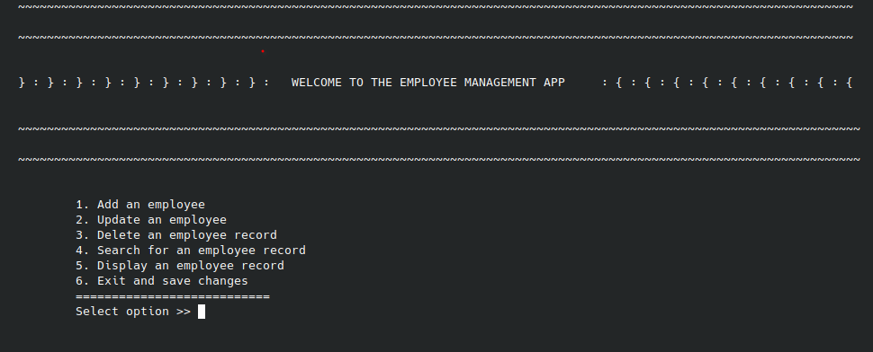

# Employee Management System


## About

The employee management system is a software which can be used to keep records of employees in a company or department on a digital print. The software was developed in c++.

## Prerequisites

To run this application on Windows you need to have a C++ compiler. The compiler will be used to interpret C++ code into machine code. The recommended compilers are either the GCC/GNU compiler or the Visual studio C++ compiler. The software uses a command line interface and therefore a command line application must be installed. Windows already has one and the same applies for linux environments.

### **Linux**

On **Linux** machines the compiler is usually shipped with the linux installation. Meaning to say that the compiler is already installed as the operatingsystem is installed.

### **Windows**

On **Windows** a Visual Studio C++ compiler can be downloaded using the visual studio installer application.

## Installation

### **Linux**

First the code in ```employee_management_system/employee.cpp``` has to be compiled therefore `cd` into the project directory and run ```*************```.

### **Windows**

First the code in ```employee_management_system/employee.cpp``` has to be compiled therefore `cd` into the project directory and run ```*************```.

## Functions

The software provides 6 functions namely ```create employee record```, ```display employee records```, ```update an employee record```, ```delete an employee record```, ```search for an employee``` and an ```exit and save function```. All of these functions can be accessed on the main menu which is the screen that greets the user.

### **Create employee**

This function is the first function on the menu. On entering 1 to create the employee record. The user is prompted to enter the full name, phone , employee ID and the email of the employee. After adding the details the employee record is added and the user is redirected to the menu.

### **Display employees**

This function displays an index of all employees in table form. Showing the employee details in a row and attributes in columns as the image below demonstrates.

### **Update employee**

As you access this function you are prompted to enter the ID of the employee record  you want to update. It is advised that the user obtains the employee id from the display employees function. On entering the employee id the user is provided with the attributes they wish to update. After updating the attributes the new attributes are displayed and then the user is redirected to the menu.

### **Delete employee**

The delete function once accessed from the menu. It prompts the user to enter the id of the employee record to be deleted. Then the employee record is deleted. When the user acceses the display function they can see that the employee has been deleted.

### **Search employee**

The search employee is accessed on the menu. On accessing the function the user is asked to enter the employee id of the record they wish to find. This function was added to solve the issue of having to scroll through the list looking for a record rather than searching for a record and retrieving the employee information.

### **Exit and save changes**

This fuction exits the software.

## Credits

Developed by: Brolin Remunyanga
Credits go out to ```Mr G. Papaya``` who taught me the concepts applied in developing the application.# employee-management
